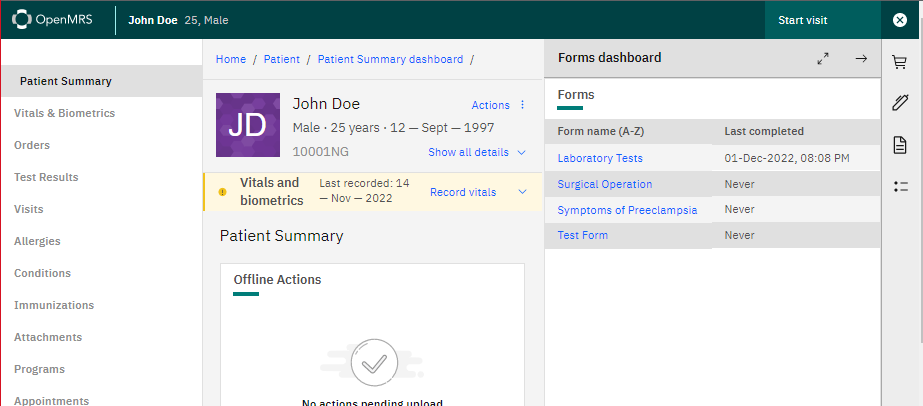
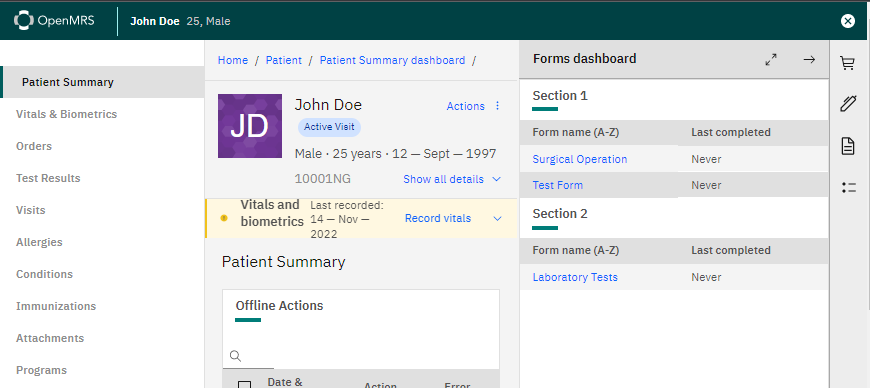

# esm-forms-workspace-app

The forms dashboard widget. It provides a tabular overview of the clinical forms available for use in the system organize by sections. 
Presently, the forms widget is configured to use forms built using the AMPATH and HtmlFormEntry form engine. Read the docs [here](https://ampath-forms.vercel.app).

By default without any configuration, the behavior should be similar to the `esm-patient-forms-app`.


Is also possible to add a configuration to split the forms by sections.
Ex. config:
```
{
   "@openmrs/esm-forms-workspace-app":{
      "orderBy":"name",
      "useCurrentVisitDates":"true",
      "formsSectionsConfig":[
         {
            "name":"Section 1",
            "forms":[
               {
                  "uuid":"96637f12-3c04-311f-b477-3fa6a866e895"
               },
               {
                  "uuid":"f186a5e6-d134-457b-8b74-ce3b518d3285"
               }
            ]
         },
         {
            "name":"Section 2",
            "forms":[
               {
                  "uuid":"336e13c6-0042-356e-9773-252382a3c7be"
               }
            ]
         }
      ]
   }
}
```


Follow bellow the configuration options:
* __orderFormsByName__: The forms will be ordered by name.
* __useCurrentVisitDates__: Will only allow to edit forms in the current visit.
* __formsSectionsConfig__: configuration for the sections:
  - __name__: Name of the section.
  - __labelCode__: Name of the section label to be translated. (This is not implemented and may change)
  - __forms__: Forms to show on the section.
    - __name__: Name of the form. This will not be translated. If this doesn't exist will be used the on from the database.
    - __uuid__: Uuid from the form.
